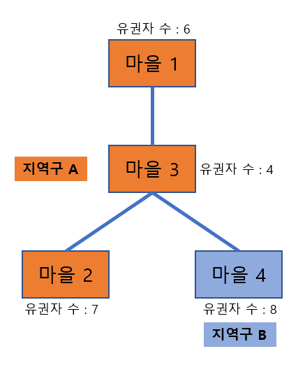
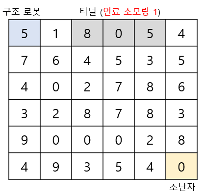

# Week 04 (23.02.27 ~ 23.03.05)

## 지역구 나누기

### 접근 방법

- 마을을 두 개의 지역구로 분리하는 모든 경우의 수 만들기 → DFS
- 두 개의 지역구로 분리하는 데 문제가 없는지 확인 → Union-Find

### 구현 내용

1. DFS를 이용해 마을을 두 개의 지역구로 분리하는 모든 경우의 수를 만든다.
   - visited 값에 따라 0지역과 1지역으로 나뉜다.
   - 시작 마을의 경우 0지역 고정 → 중복 확인 제거
2. DFS로 만든 경우의 수대로 마을을 나눴을 때 두 개의 지역구로 분리하는데 문제가 없는지 확인 (Union-Find 이용)
   - parent 초기화
   - 두 마을이 같은 지역구이면서 연결된 길이 있을 경우 같은 소속으로 Union
   - parent를 확인하며 소속의 개수 count
   - 소속의 개수가 2개라면 문제가 없다.
3. 두 개의 지역구로 분리하는데 문제가 없다면 유권자 수 차이를 계산하고 정답을 갱신한다.

## 마법의 물뿌리개

### 접근 방법

- 2(짝수)의 개수와 1(홀수)의 개수를 나눠서 생각
- 2의 경우 홀수 번째 날 두 번에 나눠 키울 수 있으니 최대한 1을 없애는 방식으로 접근

### 구현 내용

1. 나무의 높이를 저장할 height 배열과 짝수 개수와 홀수 개수를 저장할 cnt 배열 준비
2. 나무의 높이를 입력받으며 가장 큰 나무 높이 찾기
3. 모든 나무를 확인하며
   - 키가 가장 큰 나무와 같아지기 위해 필요한 길이 계산
   - 계산한 길이를 가지고 짝수 개수와 홀수 개수 count
     - 2를 만들 수 있을 만큼 최대한 만들고 (짝수 개수)
     - 1이 남았다면 1을 count (홀수 개수)
4. 짝수 개수와 홀수 개수 중 최소값(minCnt) 찾기
5. 홀수 번째 날에 1만큼, 짝수 번째 날에 2만큼 키울 수 있으니 minCnt×2 만큼 소요
6. 남은 홀수 개수와 짝수 개수 계산
7. 남은 개수 처리
   - 짝수 개수가 남은 경우
     - 필요한 길이를 3만큼(2일 소요) 키울 수 있을 만큼 키우고
     - 남은 길이값을 더해주기 (0 or 1 or 2)
   - 홀수 개수가 남은 경우
     - 홀수 번째 날마다 물 주기

## 산악 구조 로봇

### 접근 방법

- 출발 지점에서 도착 지점까지 가는데 필요한 최소 연료 → Dijkstra 응용

### 구현 내용

1. 시작 좌표에서 해당 좌표까지 가는데 필요한 최소 연료를 저장할 dist 배열 준비 (MAX값으로 초기화)
2. 해당 좌표에 연결된 터널 정보를 저장할 tunnel 배열 준비
3. 터널 정보 입력받기 (터널은 양방향으로 이동 가능)
4. Dijkstra를 이용해 시작 좌표에서 모든 좌표까지 가는데 필요한 최소 연료 계산
   1. 낮은 cost 우선인 PQ 준비 및 시작 노드 삽입
   2. PQ에서 노드를 하나씩 꺼내면서
      1. 터널이 있다면 터널 이용
         - 다음 좌표 = 터널 반대편 좌표
         - 다음 cost =  now까지 오는데 필요한 최소 연료 + 터널 이용 시 필요한 연료
      2. 상하좌우 이동
         - 방향 배열을 이용해 다음 좌표 계산
         - 다음 cost = now까지 오는데 필요한 최소 연료 +
           - 내리막인 경우 0
           - 평지인 경우 1
           - 오르막인 경우 높이 차이의 2배

## 스노우맨

### 접근 방법

- 출발 지점에서 도착 지점까지 가는데 필요한 최소 limit 계산 → Dijkstra 응용

### 구현 내용

1. 시작 좌표에서 해당 좌표까지 가는데 필요한 limit을 저장할 minLimit 배열 준비
2. 맵 정보를 입력받으면서
   - 울타리 치기
   - minLimit 배열을 MAX 값으로 초기화
   - 출발 지점, 도착 지점 찾기
3. Dijkstra를 이용해 시작 좌표에서 모든 좌표까지 가는데 필요한 최소 limit 계산
   1. 작은 limit 우선인 PQ 준비 및 시작 노드 삽입
   2. PQ에서 노드를 하나씩 꺼내면서
      1. 좌우로 이동
         1. 맵을 벗어나거나 빈 공간이거나 이미 찾은 limit보다 크거나 같은 경우 skip
         2. 다음 좌표와 최소 limit을 PQ에 삽입
            - 좌우로 이동하는 경우 필요한 게이지는 0 이므로 최소 limit 그대로
      2. 위 아래로 점프
         1. 맵을 벗어나거나 이미 찾은 limit보다 크거나 같은 경우 skip
         2. 다음 좌표와 최소 limit을 PQ에 삽입
            - 다음 좌표까지 가는데 필요한 최소 limit은 현재 좌표까지 오는데 필요한 최소 limit과 현재 jump에서 필요한 limit 중 큰 값

